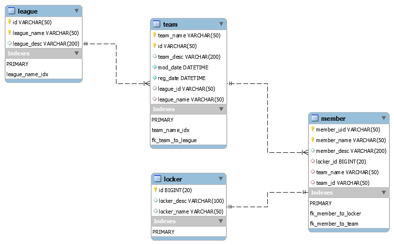

# Querydsl Sample (2019 -)

## Index
- [querydsl 을 이용하기 위한 build.gradle 세팅](https://github.com/pasudo123/pasudo123-querydsl-sample/blob/master/01.%20querydsl-gradle-setting.md)
- [repository 구조 잡기](https://github.com/pasudo123/pasudo123-querydsl-sample/blob/master/02.%20querydsl-repository-structure.md)


## Desc
- querydsl190909.mwb 파일 다운로드 이후, 로컬 MySQL Workbecn 에서 foward engineering 실시.
```commnd
mysql  Ver 8.0.13 for Win64 on x86_64 (MySQL Community Server - GPL)
```
- ddl-auto 를 validate 변경, 디비 스키마 유효성 및 관계매핑 체크
- __초기에 구동시 AppApplication 에서 테이블에 값을 인서트__ 한다.

## DB Schema



## Reference
- [querydsl 공식 repo](https://github.com/querydsl/querydsl)
- [querydsl plugin reop](https://github.com/ewerk/gradle-plugins/tree/master/querydsl-plugin)
- [querydsl reference (ver 4.1.3)](http://www.querydsl.com/static/querydsl/4.1.3/reference/html_single/#d0e2018)
- [스프링 부트에서 querydsl 사용하기 By 조졸두](https://jojoldu.tistory.com/372)
- [Repository 확장하기 By Cheese10Yun](https://github.com/cheese10yun/spring-jpa-best-practices/blob/master/doc/step-15.md)
